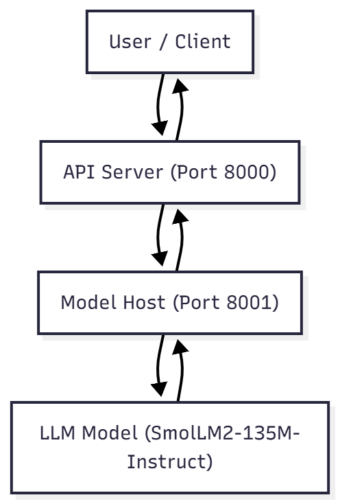

# LLM QnA System — Model Hosting and API Integration

### Candidate: Ayush Ravi  
### Internship Assignment  

---

## 1. Objective

The objective of this project is to implement a modular **Question–Answering system** using a lightweight Large Language Model (LLM).  
The system demonstrates **separation of concerns** between:

- **Model Hosting Service (Python-only):** Handles model loading and inference.  
- **API Server (Python):** Interfaces with users, forwards queries to the model host, and returns responses.

This design ensures scalability, independent deployability, and language flexibility.

---

## 2. System Architecture

Two independent FastAPI services communicate over REST APIs:

User → API Server (port 8000) → Model Host (port 8001) → LLM Inference


| Component | Description | Tech Stack | Port |
|------------|-------------|------------|------|
| **Model Host** | Loads the model, performs inference, batching, and async processing | Python, FastAPI, PyTorch, Transformers | 8001 |
| **API Server** | Receives user input, calls model host, returns processed response | Python (or Go), FastAPI, HTTPX | 8000 |

---

## 3. Architecture Diagram



---

## 4. Directory Structure


---

## 5. Environment Setup
- **Step 1— Create and Activate Virtual Environment**
python -m venv venv
venv\Scripts\activate

- **Step 2 — Install Dependencies**
pip install -r requirements.txt

If PyTorch installation fails:
pip install torch --index-url https://download.pytorch.org/whl/cpu

---

## 6. Running the Services

- **6.1 Start Model Hosting Server**
uvicorn hosting.model_server:app --host 0.0.0.0 --port 8001

Expected output:
Model loaded successfully 
Async inference worker started

- **6.2 Start API Server**
uvicorn api_server.main:app --host 0.0.0.0 --port 8000, 
uvicorn api_server.main:app --reloads

---

## 7. API Documentation


| **Service** | **Purpose** | **Swagger URL** |
|-----|-----------------------------------|--------------------------------------|
| Model Host | Model loading, generation, batching | http://127.0.0.1:8001/docs |
| API Server | User interaction and communication with model host | http://127.0.0.1:8000/docs |


These separate endpoints confirm proper separation of concerns and independent deployability.

---

## 8. Usage Examples

- **8.1 Single Inference:**

  **Endpoint:** `/generate` (Model Host) or `/chat` (API Server)

  **Request:**
  ```json
  {
    "chat_id": "1",
    "system_prompt": "You are a helpful assistant.",
    "user_prompt": "Capital of India?"
  }

**Response:**
```json
{
  "chat_id": "1",
  "response": "The capital of India is New Delhi."
}
```

- **8.2 Batch Inference:**
**Endpoint:** /generate/batch (Model Host)

**Request:**
```json
{
  "queries": [
    {"chat_id": "1", "system_prompt": "You are helpful", "user_prompt": "Capital of India?"},
    {"chat_id": "2", "system_prompt": "You are helpful", "user_prompt": "Capital of France?"},
    {"chat_id": "3", "system_prompt": "You are helpful", "user_prompt": "Capital of Japan?"}
  ]
}
```

**Response:**
```json
[
  {"chat_id": "1", "response": "The capital of India is New Delhi."},
  {"chat_id": "2", "response": "The capital of France is Paris."},
  {"chat_id": "3", "response": "The capital of Japan is Tokyo."}
]
```

---

## 9. Evaluation Criteria (As per Assignment)
| **Criterion** | **Description** | **Status** |
|-----|----------------------------------|--------|
| Model Integration | LLM successfully loaded and inferenced | done |
| Concurrent Processing | Implemented asynchronous queue for parallel inference | done |
| Separation of Concerns | Distinct model host and API server | done |
| Code Quality & Error Handling | Validations, exceptions, and logging handled | done |
| Documentation | This README + clear architecture explanation | done |

---

## 10. Bonus Implementations
- **10.1 Dynamic Batching**

   * Implemented /generate/batch endpoint to process multiple prompts in one call.

   * Reduced model invocation overhead and improved throughput.

- **10.2 Async Inference Queue**

   * Introduced asyncio.Queue() with a background worker for non-blocking requests.

   * Ensures smooth concurrent processing and responsiveness.

---


## 11. Design Highlights

- **Loose Coupling:** API and model host are fully independent and deployable separately.

- **Language Flexibility:** API layer can be rewritten in Go without affecting Python model host.

- **Scalability:** Model host can scale on GPU or container clusters; API can scale horizontally.

- **Maintainability:** Modular directory structure and clear service boundaries.

---

## 13. Conclusion

The project successfully demonstrates:

   * Correct model integration and inference using Hugging Face Transformers.

   * Asynchronous concurrent processing with batching optimization.

   * Clean architectural separation between model and API layers.

   * Documented performance improvements and deployment clarity.

   * This implementation fulfills all core and bonus requirements stated in the assignment.